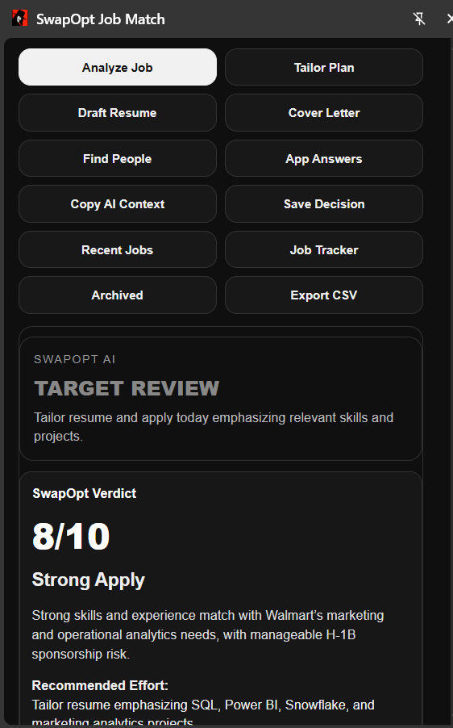
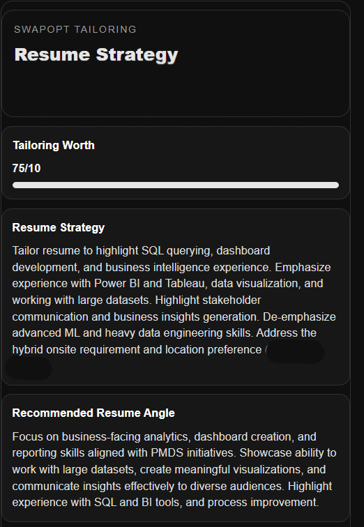
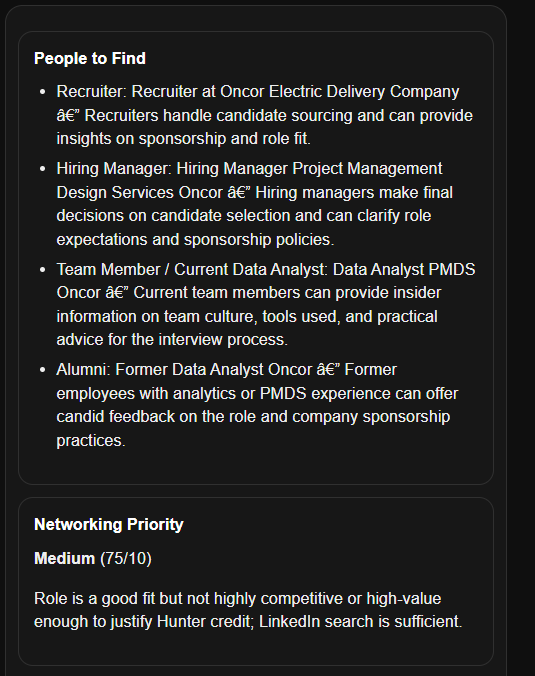
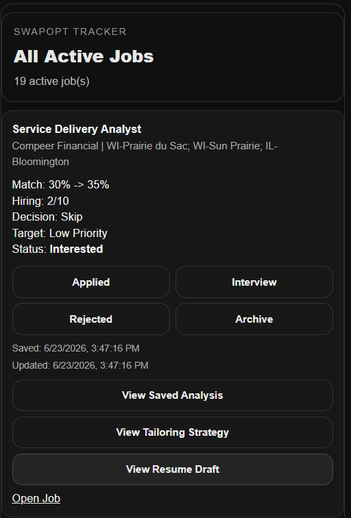

# 🚀 SwapOpt AI — Job Decision Engine

## 📸 Demo

### Job Decision Engine


### AI Resume Tailoring Strategy


### Smart Networking Prioritization


### Application Tracker


Most job tools help you apply faster.

I wanted to build something that helps me decide whether I should apply at all.

SwapOpt AI is a Chrome Extension powered by AI that analyzes job opportunities and helps make smarter application decisions based on fit, effort, career value, and strategy.

Instead of asking:

"How do I apply to more jobs?"

SwapOpt asks:

"Which jobs actually deserve my time?"

---

## 💡 Why I Built This

While thinking about productivity, I realized a lot of time is lost not just doing work, but deciding what work deserves attention.

Job searching has the same problem.

Every application requires decisions:

- Is this role realistic for me?
- How much should I tailor my resume?
- Is this company worth extra effort?
- Should I network?
- What should I highlight?

SwapOpt became my personal AI layer to reduce repetitive decisions and focus effort where it matters.

---

# ✨ Features

## 🎯 Job Intelligence Analysis

Analyzes job postings beyond simple keyword matching.

Evaluates:

- Resume alignment
- Experience match
- Skill transferability
- Career upside
- Posting quality
- H-1B/access risk
- Competition difficulty

Generates:

- Apply score
- Decision recommendation
- Strength factors
- Risk factors

---

## 🧠 Smart Resume Tailoring Strategy

Not every job deserves the same effort.

SwapOpt recommends:

**High Priority**
- Deep customization
- Project repositioning
- Resume restructuring

**Medium Priority**
- Keyword optimization
- Relevant experience emphasis

**Low Priority**
- Quick apply or skip

---

## 📄 Resume Draft Assistant

Creates role-specific resume suggestions while keeping experience truthful.

Principles:

- No fake experience
- No overclaiming
- ATS optimized
- Maintains authentic career story

---

## ✉️ Cover Letter Assistant

Generates short personalized cover letters designed for application forms.

Focus:

- Human tone
- Relevant skills
- Business impact
- Role alignment

---

## 📝 Application Answer Assistant

Helps answer:

- Why this company?
- Why this role?
- Tell me about yourself
- Relevant experience questions
- Behavioral prompts

---

## 🤝 Networking Intelligence

Networking takes time.

SwapOpt decides if outreach is worth it.

Priority Levels:

**HIGH**
- Spend time networking
- Find recruiters/hiring managers

**MEDIUM**
- LinkedIn research recommended

**LOW**
- Apply without extra effort

---

## 🔎 Hunter Integration

Uses Hunter API intelligently.

Before using limited searches, SwapOpt evaluates:

"Is this opportunity worth spending a contact search?"

If yes:

- Finds relevant contacts
- Generates LinkedIn notes
- Creates outreach messages

---

## 📌 Job Tracker

Save and manage opportunities:

- Interested
- Applied
- Interview
- Rejected
- Archived

Export applications to CSV.

---

# 🛠️ Tech Stack

**Frontend**
- Chrome Extension Manifest V3
- JavaScript
- HTML/CSS
- Chrome Storage API

**Backend**
- Node.js
- Express.js

**AI**
- OpenAI API

**Integrations**
- Hunter API

---

# ⚙️ Setup

Clone repository:

```bash
git clone <repo-url>
cd swapopt-job-match
```

Install dependencies:

```bash
cd server
npm install
```

Create `.env`

```env
OPENAI_API_KEY=your_key
HUNTER_API_KEY=your_key
PORT=8787
```

Start backend:

```bash
node server.js
```

Load extension:

```
Chrome Extensions
→ Developer Mode
→ Load Unpacked
→ Select extension folder
```

---

# 🔒 Privacy

Private information is stored locally.

Excluded from GitHub:

- API keys
- Personal profile files
- Resume documents
- Environment variables

---

# 🎯 Philosophy

Applying everywhere creates noise.

Over-optimizing every application wastes time.

SwapOpt focuses on applying intentionally.

Work smarter, not just faster.

---

Built by Swapnil Herwadkar
