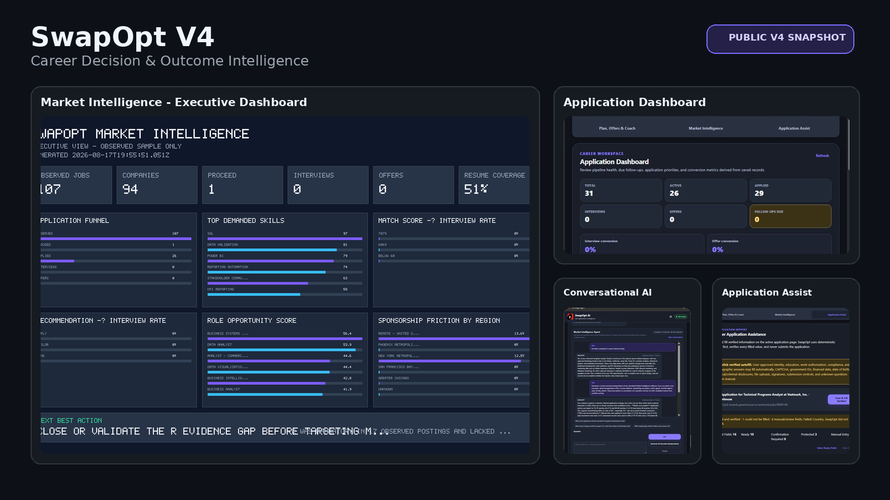
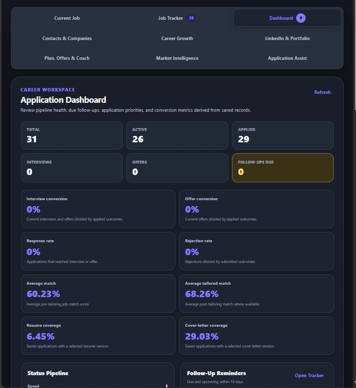
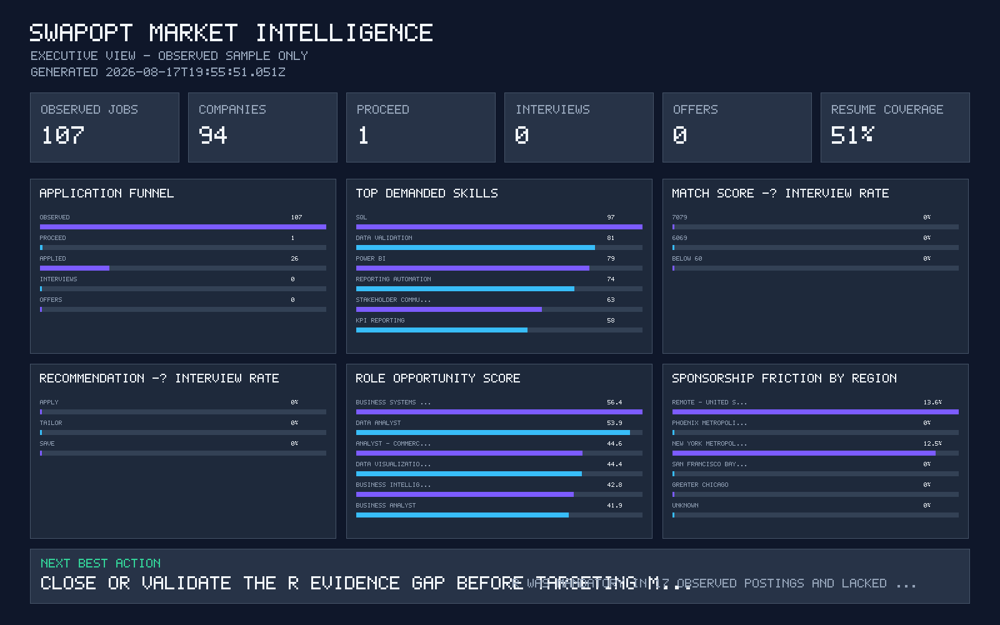
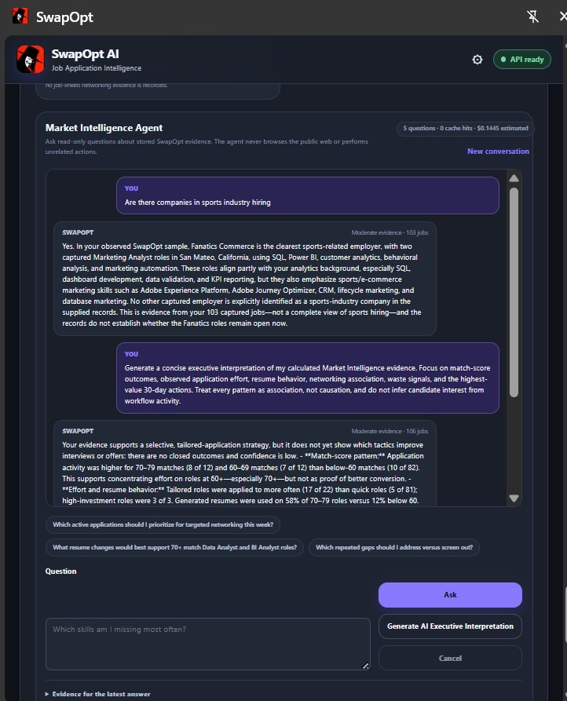
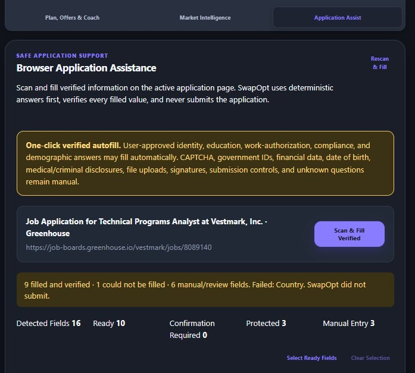
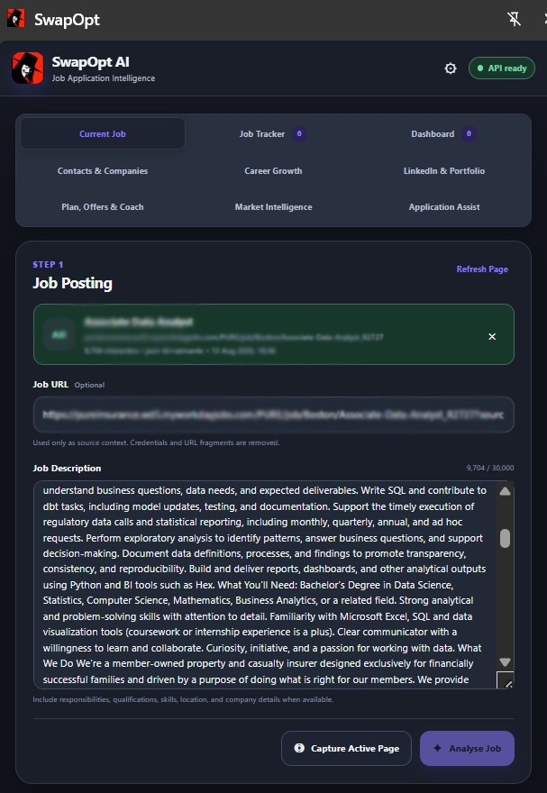

# SwapOpt

### AI Career Decision & Outcome Intelligence

<!-- SWAPOPT_PUBLIC_V4_STATUS_START -->
[](https://github.com/SHV-19/SwapOpt-AI-Job-Decision-Engine/actions/workflows/v4-showcase-ci.yml)
[](docs/PUBLIC_SOURCE_MAP.md)
[](https://github.com/SHV-19/SwapOpt-AI-Job-Decision-Engine/releases/tag/v4.0.0)

**Public V4 engineering snapshot:** a curated, sanitized implementation slice covering career evidence, outcome intelligence, decision learning, personal learning, and market intelligence. Public CI runs privacy verification plus 24 representative tests.

[Architecture](docs/ARCHITECTURE_V4.md) | [Public Source Map](docs/PUBLIC_SOURCE_MAP.md) | [Defensibility](docs/DEFENSIBILITY.md) | [Privacy](docs/PRIVACY.md) | [Historical V1](docs/HISTORICAL_V1.md)
<!-- SWAPOPT_PUBLIC_V4_STATUS_END -->

<!-- SWAPOPT_V4_HERO_START -->
<p align="center">
  
</p>
<p align="center"><sub>Current V4 product surfaces: application intelligence, market intelligence, conversational analysis, and verified application assistance.</sub></p>
<!-- SWAPOPT_V4_HERO_END -->

**SwapOpt is a browser-first career intelligence system that helps a job seeker decide where to invest effort, execute applications more consistently, and learn from real outcomes over time.**

Most career tools begin with:

> How do I apply faster?

SwapOpt begins with:

> **Which opportunities actually deserve my time?**

The product connects verified career evidence, job intelligence, application execution, ATS assistance, market intelligence, and longitudinal outcomes into one decision loop:

```text
Career Evidence
      ↓
Opportunity
      ↓
Decision
      ↓
Action
      ↓
Application / ATS
      ↓
Outcome
      ↓
Learning
      └──────────────► Better Next Decision
```

> **Repository note:** this is a sanitized public showcase of SwapOpt. Personal candidate data, resumes, application history, secrets, and private operational state are intentionally excluded.

---

## Product Thesis

Job search is not only a writing problem. It is a **resource-allocation problem**.

Every opportunity forces a candidate to decide:

- Is this role realistically worth pursuing?
- How strong is the fit?
- What are the major risks?
- Is resume tailoring worth the time?
- Should networking receive extra effort?
- What should be emphasized?
- Which application answers are safe and truthful?
- What patterns are emerging across prior applications?
- Is the current strategy producing interviews?

SwapOpt treats those questions as one connected decision system instead of a collection of disconnected AI prompts.

---

## V4 System Overview

SwapOpt V4 is organized around five connected product systems.

### 1. Decide — Job Intelligence

Evaluates an observed role using structured evidence rather than keyword matching alone.

Examples of signals include:

- role and experience alignment
- verified skill evidence
- mandatory vs preferred requirements
- sponsorship / work-authorization risk
- career upside
- effort required
- recommendation confidence
- historical outcome context when enough evidence exists

The result is an actionable recommendation such as:

**Apply / Tailor / Save / Skip**

with an explanation of why.

---

### 2. Prepare — Truthful Application Material

SwapOpt supports:

- resume strategy
- application-ready resume generation
- cover letters
- interview preparation
- professional branding
- project positioning

Truthfulness is a hard constraint. The system is designed to strengthen verified experience rather than inventing experience, skills, achievements, or metrics.

---

### 3. Execute — ATS & Application Assistance

The application layer reduces repetitive form work while preserving explicit user control.

Capabilities include:

- canonical application-question handling
- ATS-aware answer formatting
- work-authorization and sponsorship distinctions
- employment-history handling
- salary-field formatting
- application-answer assistance
- browser-side form support
- reusable ATS intelligence across multiple recruiting platforms

SwapOpt does **not** autonomously submit applications.

---

### 4. Track — Application Lifecycle Intelligence

SwapOpt tracks the journey from opportunity to outcome.

```text
Observed
   ↓
Proceed
   ↓
Applied
   ↓
Interview
   ↓
Offer / Rejected / Withdrawn
```

This allows application activity to become structured evidence rather than disappearing into spreadsheets or browser tabs.

---

### 5. Learn — Personal Market & Outcome Intelligence

This is the layer that makes SwapOpt more than an AI writing assistant.

The system connects:

- verified career evidence
- observed jobs
- recommendations
- actual user behavior
- submitted applications
- lifecycle events
- interviews
- offers
- rejections
- market patterns

Historical outcomes are treated as **observational evidence**, not proof of causation.

SwapOpt can therefore ask:

> Which role families appear strongest for this user?

> Where is application effort being wasted?

> Which recommendations are associated with stronger outcomes?

> Is recent interview conversion improving or declining?

> What should change in the next 30 days?

---

## Defensibility

The visible features can be reproduced.

The harder-to-copy layer is the **private longitudinal decision intelligence** that accumulates underneath them.

### Career Evidence Graph

Connects verified candidate evidence, skills, experience, projects, education, jobs, requirements, applications, and outcomes with provenance.

### Career Outcome Engine

Uses accumulated historical evidence conservatively when evaluating future opportunities.

### ATS Intelligence Layer

Normalizes recurring recruiting questions and form behavior across ATS platforms instead of relying entirely on one-off browser fixes.

### Personal Market Intelligence

Builds a private view of the user's actual labor market from observed opportunities and outcomes.

### Decision Learning Loop

Audits:

```text
Recommendation → User Action → Outcome → Learning
```

A competitor can copy a screen or prompt. It cannot instantly recreate a user's accumulated evidence, decision history, ATS interactions, and longitudinal outcomes.

See [Defensibility](docs/DEFENSIBILITY.md).

---

## Architecture

SwapOpt follows a modular, backend-owned architecture.

```text
┌───────────────────────────┐
│     Chrome Extension      │
│  capture + interaction    │
└─────────────┬─────────────┘
              │
              │ versioned JSON APIs
              ▼
┌───────────────────────────┐
│      Node.js Backend      │
│ validation + orchestration│
└─────────────┬─────────────┘
              │
      ┌───────┼────────┬──────────┐
      ▼       ▼        ▼          ▼
   Career   Decision   ATS      Market
   Evidence Engines  Intel.     Intel.
      │       │        │          │
      └───────┴────────┴────┬─────┘
                            ▼
                  Application Lifecycle
                            │
                            ▼
                     Outcome Learning
                            │
                            └────► Next Decision
```

The extension remains a lightweight client. Business rules, persistence, AI orchestration, and sensitive decision logic belong in backend services.

See [Architecture](docs/ARCHITECTURE_V4.md).

---

## Engineering Principles

SwapOpt is built around a small set of permanent rules:

- **Truth above everything** — never fabricate candidate evidence.
- **Decision-first AI** — reasoning precedes generation.
- **Backend-owned intelligence** — clients stay lightweight.
- **Reuse before rebuild** — extend working modules rather than creating competing systems.
- **Modular growth** — features should strengthen architecture over time.
- **Cost-aware AI** — deterministic logic is preferred when AI is unnecessary.
- **Explicit user control** — no autonomous mass application submission.
- **Outcome learning without false causality** — historical patterns inform decisions conservatively.

---

## Selected Public V4 Source

The repository includes a **curated, sanitized slice of the real V4 backend intelligence** rather than a copy of the private runtime environment.

The public source currently focuses on the compounding decision layer:

- Career Evidence Graph foundations and provenance policy
- Career Outcome Engine
- Decision Learning Loop
- Personal Learning
- Market Intelligence normalization and aggregation
- Application behavior intelligence
- adaptive job-analysis policy
- repository boundaries required by those services

Representative tests use synthetic data and verify behaviors such as:

- preserving interview evidence after a later rejection
- exposing recommendation calibration without claiming causality
- preventing weak outcome samples from changing recommendations
- keeping explicit sponsorship evidence authoritative over historical patterns
- preventing resume coverage from exceeding 100%
- separating observed demand, submitted applications, and outcomes
- preventing cross-user Market Intelligence access

The provider-specific ATS answer catalog and user-specific application-answer policy are intentionally **not** part of the public source snapshot because those areas can contain sensitive candidate preferences.

See [Public Source Map](docs/PUBLIC_SOURCE_MAP.md) for the exact boundary.


---

## Demo & Case Study

### Video Walkthrough

[YouTube Demo](https://www.youtube.com/watch?v=eeqZPgQ6wG0)

The video shows the earlier browser workflow: live job analysis, resume strategy, application support, networking recommendations, and job tracking.

### Technical Case Study

[Medium — “I Had No Other Choice, So I Built an AI to Judge My Job Applications”](https://medium.com/@swapnilherwadkar/i-had-no-other-choice-so-i-built-an-ai-to-judge-my-job-applications-0367e561eba5)

### Historical Design Report

The original V1 design report remains available in `docs/` as historical project documentation. The current architecture has evolved substantially beyond that initial implementation.

---

## Current V4 Product Screens

These screenshots are from the current sanitized V4 workflow and contain no private candidate profile, resume, demographic, OAuth, or application-history data.

| Application Dashboard | Market Intelligence |
|---|---|
|  |  |

| Conversational Market Intelligence | Verified Application Assistance |
|---|---|
|  |  |

### Job Intelligence



---
## Technology

**Client**
- Chrome Extension
- Manifest V3
- JavaScript
- HTML / CSS
- Chrome APIs

**Backend**
- Node.js
- Express
- modular service architecture
- structured validation and persistence

**AI**
- OpenAI API
- structured prompts and response contracts
- model routing / cost-aware orchestration

**Integrations**
- Hunter.io
- Google integrations where user-authorized
- supported ATS/browser workflows

**Analytics**
- application lifecycle intelligence
- personal market intelligence
- decision/outcome learning

---

## Public Repository Scope

This repository is intentionally sanitized.

Excluded from public source control:

- personal profile data
- resumes
- application history
- demographic / EEO answers
- API keys and OAuth tokens
- local databases and operational state
- private outcome history
- batch backups and internal recovery material

The public repository exists to demonstrate product thinking, architecture, engineering approach, and selected implementation concepts without publishing personal user data.

---

## Validate the Public V4 Intelligence Slice

The curated V4 source is intentionally dependency-light and can be validated without API credentials.

Requirements:

```text
Node.js 22+
```

Run the public-source privacy boundary check:

```bash
node scripts/verify-public-showcase.mjs
```

Run the representative V4 tests:

```bash
node --test \
  tests/unit/services/application-behavior-intelligence.test.js \
  tests/unit/services/career-learning-loop-intelligence.test.js \
  tests/unit/services/career-outcome-engine-service.test.js \
  tests/unit/services/market-intelligence-service.test.js \
  tests/unit/services/personal-market-strategy.test.js
```

These tests exercise the public intelligence slice only. The private V4 runtime includes additional application, ATS, browser, provider, and user-specific components that are intentionally not mirrored into this repository.

The earlier prototype remains useful as project history, while the `backend/` V4 source demonstrates the current decision/outcome architecture.

---

## Privacy & Safety

SwapOpt is designed around explicit user ownership of career data.

It does not intentionally publish personal application data, and the public repository excludes private candidate information.

The product also does not:

- fabricate candidate experience
- bypass CAPTCHA or anti-bot controls
- autonomously submit mass applications
- send outreach without explicit user control

See [Privacy & Public Repository Boundary](docs/PRIVACY.md).

---

## Project Direction

The core V4 architecture now focuses on a compounding loop:

```text
Evidence
  ↓
Decision
  ↓
Execution
  ↓
Outcome
  ↓
Learning
  ↓
Better Decision
```

The goal is not to maximize application volume.

The goal is to help a candidate invest effort where it is most likely to create career value.

---

## Built By

**Swapnil Herwadkar**

- [Portfolio](https://shv-19.github.io/swapnil-herwadkar-portfolio/)
- [LinkedIn](https://www.linkedin.com/in/shv98/)
- [GitHub](https://github.com/SHV-19)
